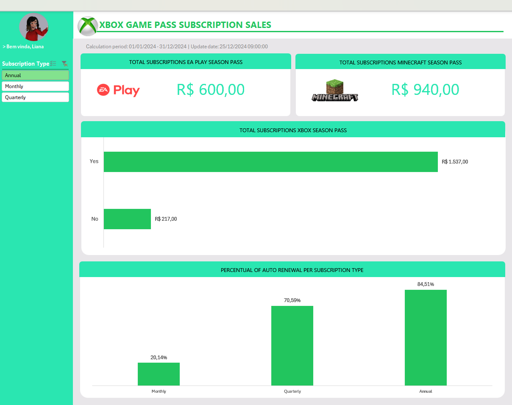

# 📊 Dashboard de Vendas Xbox — Excel Edition

Seja bem-vindo(a) ao projeto **Dashboard de Vendas Xbox**, desenvolvido em **Excel** como parte do meu portfólio em análise de dados. A proposta é simples (e poderosa!): transformar dados brutos de assinaturas do Xbox em insights visuais claros e organizados.



## 🎯 Objetivo

Criar um dashboard de vendas no Excel que destaque **métricas importantes**, facilite a visualização de padrões de consumo e apoie a **tomada de decisões baseada em dados**. Além disso, este projeto serve como guia prático para quem quer aprender a desenvolver dashboards eficientes em Excel.

## 📁 Estrutura do Arquivo

O arquivo principal se chama:

```
dashboard-vendas-xbox.xlsx
```

Ele contém quatro abas principais:

- **Assets**: recursos visuais, ícones ou elementos gráficos utilizados no dashboard.
- **Bases**: dados brutos utilizados para análise.
- **Cálculos**: tratamento dos dados, fórmulas e métricas intermediárias.
- **Dashboard**: visualização final com gráficos, KPIs e filtros.

## 🧾 Dados Utilizados

O conjunto de dados utilizado inclui os seguintes campos:

- `Subscriber ID`: identificador único de cada assinante
- `Name`: nome do assinante
- `Plan`: tipode plano contratado
- `Start Date`: data de início da assinatura
- `Auto Renewal`: status de renovação automática (yes/no)
- `Subscription Price`: preço da assinatura
- `Subscription Type`: tipo de assinatura (mensal, trimestral, anual)
- `EA Play Season Pass`: status de assinatura do serviço EA Play (yes/no)
- `EA Play Season Pass Price`: valor da assinatura do serviço EA Play
- `Minecraft Season Pass`: status de assinatura do serviço Minecraft (yes/no)
- `Minecraft Season Pass Price`: valor da assinatura do serviço Minecraft
- `Coupon Value`: valor de desconto aplicado
- `Total Value`: valor total pago pelo assinante

Essas informações permitiram criar análises sobre comportamento de assinantes, valores pagos, uso de cupons, e muito mais!
Os dados foram organizados e preparados no Excel, facilitando a criação de tabelas dinâmicas e gráficos automatizados.

## 📂 Estrutura do Projeto

- `/data`: arquivo `.xlsx` com os dados brutos
- `/dashboard`: planilha com o dashboard pronto
- `/img`: capturas de tela do dashboard 

## 🛠️ Como Reproduzir

1. Faça o download do repositório ou clone via terminal:
   ```bash
   git clone https://github.com/anapcrodrigues/dashboard-excel-xbox.git
   ```

2. Abra o arquivo `dashboard-vendas-xbox.xlsx` no Excel (versão 2016 ou superior recomendada).

3. Navegue pelas abas e explore os dados e visualizações.

4. Os filtros disponíveis no dashboard permitem análises segmentadas com facilidade.

## 🎓 Para Quem é Este Projeto?

- Iniciantes em análise de dados com Excel  
- Estudantes de Data Analytics que querem montar seu portfólio  
- Profissionais que desejam transformar relatórios em algo mais visual e interativo

## 👀 Requisitos
- Excel 2016 ou superior (compatível com tabelas dinâmicas e segmentações)

## 🤝 Contribua
Sugestões, feedbacks e melhorias são super bem-vindos. Sinta-se à vontade para abrir uma issue ou mandar um pull request! 😄

---

💡 Curtiu o projeto? Me dá uma estrela ⭐️ e fique à vontade pra contribuir com feedbacks ou melhorias.  
📬 Se quiser trocar uma ideia, tô por aqui!
